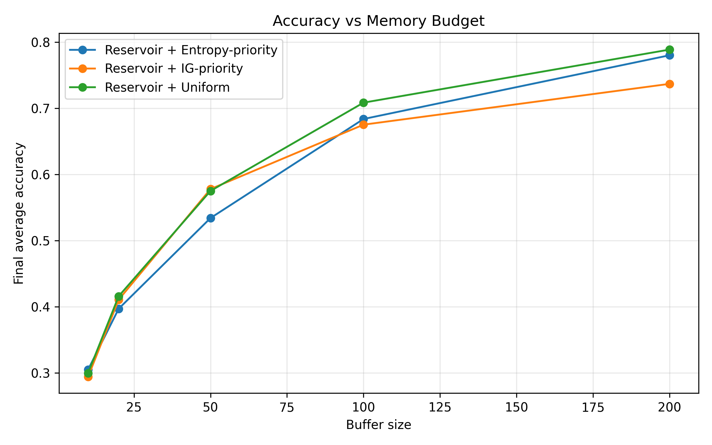
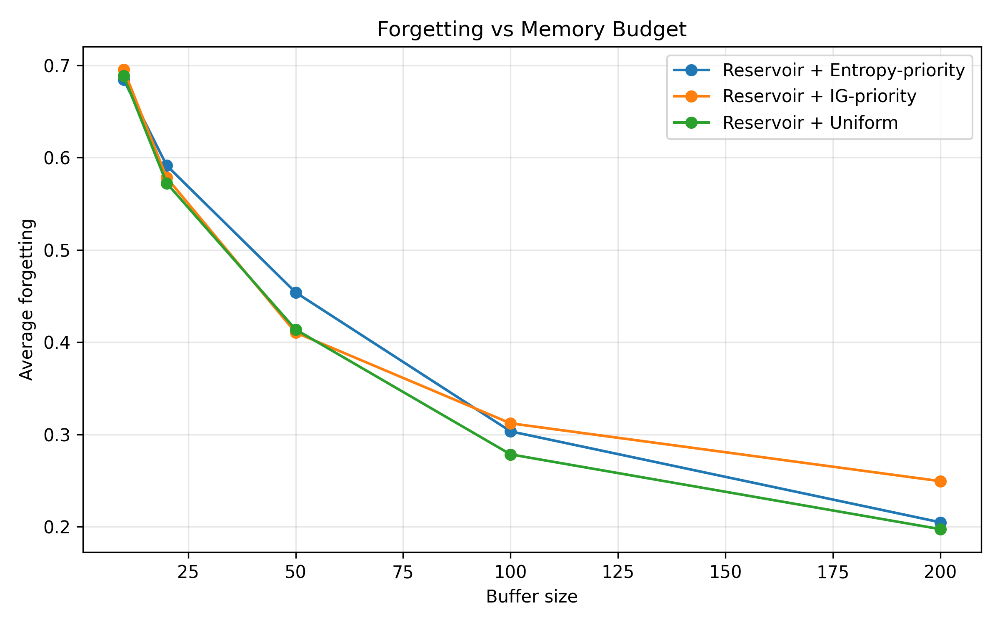

# Regime-Dependent Replay Strategies in Continual Learning

## 📌 Overview

This project investigates how replay strategies behave under **strict memory constraints** in continual learning systems.

Modern AI systems deployed on edge devices and adaptive environments must learn continuously under limited memory. A key design question is:

> Should we store data uniformly, or prioritize "important" samples?

This work studies replay prioritization as a **regime-dependent systems problem**, evaluating when sophisticated methods help—and when they do not.

---

## 🧠 Key Findings

- No replay strategy consistently dominates under extreme memory constraints
- Information Gain (IG) and entropy-based prioritization show **high variance and unstable gains**
- Uniform replay becomes increasingly effective as memory capacity grows
- Replay should be treated as a **systems-level design decision**, not a universally optimal algorithm

---

## ⚙️ Methods

We compare three replay strategies:

- **Uniform Reservoir Replay** (baseline)
- **Entropy-Based Prioritization**
- **Information Gain (BALD via MC Dropout)**

### Experimental Setup

- Sequential task learning (continual learning setting)
- Fixed-capacity replay buffer
- Memory budgets: `[10, 20, 50, 100, 200]`
- 5 random seeds per configuration
- Metrics:
  - Final Average Accuracy
  - Forgetting
  - Cross-seed Variance (stability)

---

## 📊 Results

### Accuracy vs Memory



### Forgetting vs Memory



---

## 🔍 Interpretation

Results reveal a **coverage–salience tradeoff**:

- Under extreme scarcity → prioritization provides **marginal and unstable benefits**
- As memory increases → **coverage (uniform replay) dominates**
- IG-based prioritization introduces **higher variability**, reducing predictability

👉 This suggests that prioritization can amplify stochastic noise without consistent gains.

---

## 💼 Why This Project Matters

- Demonstrates **system-level thinking in ML**
- Explores tradeoffs between **performance, stability, and memory constraints**
- Relevant for:
  - Edge AI
  - Continual learning systems
  - Production ML pipelines

## 🚀 How to Run

### 1. Clone the repository
git clone https://github.com/Ebb-pixel/continual-learning-replay.git
cd continual-learning-replay

### 2. Install Dependencies
pip install -r requirements.txt

### 3. Run Experiments
python -m scripts.run_experiment

### Generate Plots
python -m src.evaluation.plot_results

## 📁 Project Structure

```text
continual-learning-replay/
│
├── src/
│   ├── models/        # neural network architecture
│   ├── buffers/       # replay buffer implementations
│   ├── training/      # training pipeline
│   ├── strategies/    # prioritization methods (entropy, IG)
│   └── evaluation/    # plotting and analysis
│
├── scripts/
│   └── run_experiment.py   # experiment runner
│
├── results/          # experiment outputs and plots
│
├── requirements.txt
└── README.md
